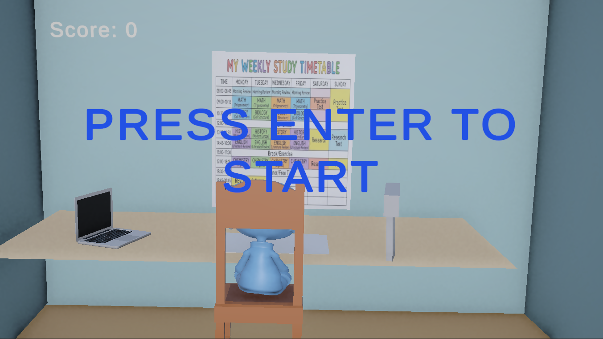
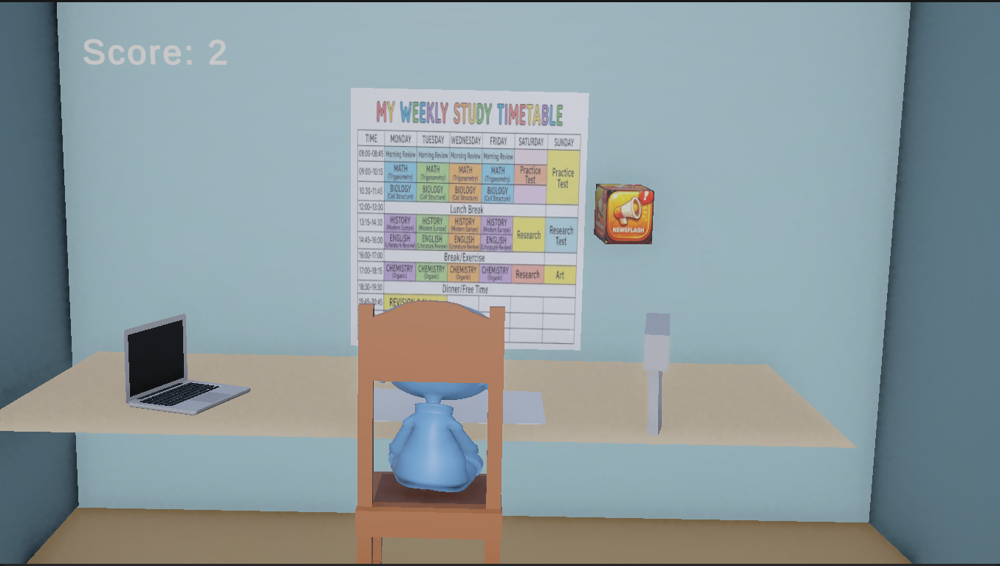
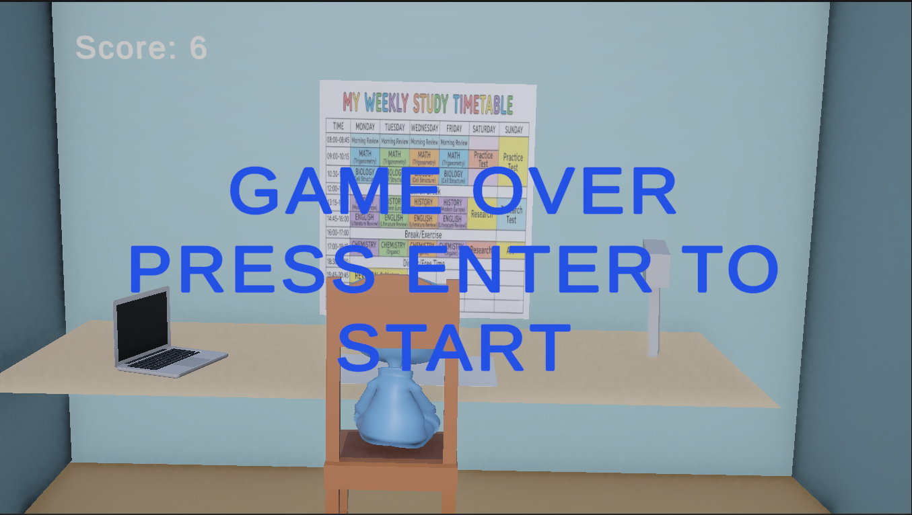

# Focus Defender


An arcade-style action game that gamifies the struggle to maintain focus while studying. Defend your study session by shooting down incoming digital distractions before they reach your desk!

## 🎮 Game Concept

In **Focus Defender**, players embody a student defending their concentration from the relentless barrage of digital distractions. Social media notifications, news alerts, video suggestions, and chat messages appear as falling threats that must be eliminated before they disrupt your study flow. It's a fun, fast-paced metaphor for the real-world battle against procrastination and digital interruptions.

This game was created as a portfolio project during my Unity learning journey. I've completed the Unity Essentials course and am midway through the Junior Programmer pathway, applying core concepts like game mechanics, physics, UI, and asset management.

## ✨ Features

- **4 Unique Distraction Types**: Face off against ChatLoop (messaging apps), InstaBuzz (social media), NewsFlash (news alerts), and VidStream (video platforms)
- **Simple Yet Addictive Gameplay**: Move and shoot in a constrained study room environment
- **Real-Time Scoring**: Earn points for each distraction destroyed
- **Audio Feedback**: Satisfying sound effects for shooting and destruction
- **Quick Sessions**: Perfect for short study breaks
- **Thematic Design**: Study room setting with desk and laptop models

## 🎯 How to Play

### Objective

Destroy all incoming digital distractions before they reach your desk. If any distraction makes contact, it's game over!

### Controls

- **Movement**: Arrow Keys or WASD
- **Shoot**: Spacebar
- **Start/Restart**: Enter

### Gameplay Flow

1. Press ENTER to start the game
2. Distractions spawn randomly from the top every 5 seconds
3. Move your character and shoot bullets to destroy threats
4. Score points for each successful hit
5. If a distraction reaches your position, game over
6. Press ENTER to restart and try for a higher score

## 📸 Screenshots







## 🛠️ Technical Details

- **Engine**: Unity 2021.3+
- **Language**: C#
- **Key Dependencies**:
  - TextMesh Pro (for UI text)
  - Unity Input System
- **Physics**: Built-in Unity physics for collision detection
- **Audio**: WAV and MP3 sound effects

## 📁 Project Structure

```
Assets/
├── Scripts/          # Core gameplay logic
│   ├── GameStartManager.cs
│   ├── SpawnManager.cs
│   ├── Shooting.cs
│   ├── ScoreManager.cs
│   ├── MediaMove.cs
│   └── DetectCollision.cs
├── Scenes/
│   └── StudyRoom.unity
├── Prefabs/          # Distraction and bullet prefabs
├── Characters/       # Player models
├── Sounds/           # Audio effects
├── Images/           # Textures and UI
└── Materials/        # 3D materials
```

## 🚀 Installation & Setup

1. **Clone the repository**:

   ```bash
   git clone https://github.com/Abhimanyusit/Focus_Defender_Game.git
   ```

2. **Open in Unity**:
   - Launch Unity Hub
   - Add the project folder
   - Open with Unity 2021.3 or later

3. **Build and Run**:
   - File > Build Settings
   - Select your target platform (PC recommended)
   - Build and Run

## 🎨 Assets & Credits

- **3D Models**: Boy character from [Mixamo](https://www.mixamo.com/), chair and laptop from [OpenGameArt.org](https://opengameart.org/)
- **Audio**: GunShort.wav (shooting) and Pop.mp3 (destruction) sound effects from [Mixkit.co](https://mixkit.co/)
- **Textures**: Custom PNG sprites for distraction types
- **Fonts**: TextMesh Pro for UI elements

All assets were created or sourced for this educational project.

## 📈 Future Enhancements

- Difficulty scaling (increasing spawn rates)
- Additional distraction types and power-ups
- High score persistence
- Mobile touch controls
- Soundtrack and background music
- Particle effects for destruction

## 🎉 Play the Game

This game is also available on **itch.io**: [Focus Defender on itch.io](https://abhi8451.itch.io/focus-defender)

## 🤝 Contributing

This is a portfolio project, but feel free to fork and experiment! If you have suggestions or improvements, open an issue or submit a pull request.

## 📧 Contact

Created by Abhimanyu Jha - Learning Unity and game development.

---

_Made with ❤️ using Unity - A journey from Unity Essentials to Junior Programmer._
